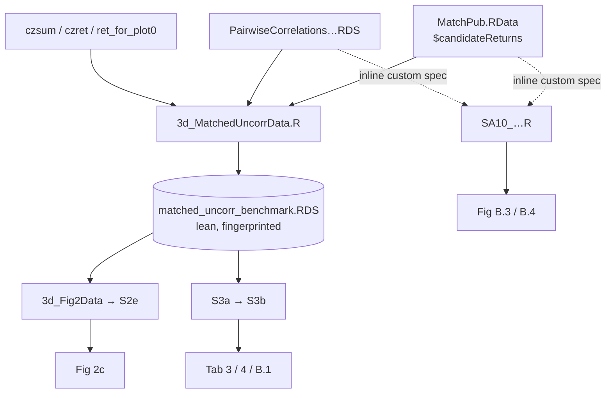

# Matched-uncorr wiring: keep the current design

*2026-08-15 EDT — branch `clean/matched-uncorr-pipe`. See `0814g_plan_matched-uncorr-single-source.md` for the prose.*

## Decision: the current design is fine, keep it

The split we already have is the right one:

- **Main-text exhibits go through a shared, materialized cache.** Fig 2c and
  Tab 3/4/B.1 read `matched_uncorr_benchmark.RDS` — one curated, fingerprinted
  intermediate that defines the canonical matched-uncorr concept once.
- **Appendix robustness exhibits use custom settings, computed inline, without
  their own intermediate output** (where feasible). SA10 (Fig B.3/B.4) applies
  its own screens directly off the raw caches and writes no cache of its own.

### Why this is acceptable

- **SA10 is fast**, so the extra `MatchPub` deserialize costs little and there is
  no speed reason to route it through the benchmark.
- **There is no threshold sweep to support.** `exclCorrelations = c(10)` — the
  `c(10,20,30,40,50)` is commented out (SA10:114/209) — and B.3/B.4's `a–d`
  panels are **theory facets**, not thresholds. The appendix has exactly two
  fixed screen variants: B.3 (`rho <= 0.10`, = the benchmark's canonical column)
  and B.4 (`rho <= 0.10 & d_mean <= 0.1`, a distinct tighter screen).
- **`matched_uncorr_benchmark.RDS` stays as-is.** It anchors a reproducibility
  contract (`tests/test_matched_uncorr_contract.R` asserts a
  `pair_fingerprint_sha256` that S3a stamps into `mp_style_decay_models.RDS`), so
  it is not something to dissolve or fold new variants into.

### Ideas considered and set aside

- **A new `matched_uncorr_eventlevel.RDS` cache** feeding SA10 — dropped; its
  speed and threshold-sweep justifications both collapsed (above).
- **Folding SA10 into the benchmark contract** — unnecessary once the inline
  appendix path is accepted as the intended design, not a bug.
- **Deleting `3d_MatchedUncorrData.R` and sharing a function instead** — a
  heavier edit that re-runs the `MatchPub` deserialize per caller and removes the
  materialized artifact the fingerprint contract depends on.

The one residual (not blocking): SA10's screen literals (`r_tol_cor <- 0.1`,
`c(10)`) are hardcoded rather than pulled from `globalSettings`, so a retuned
main-text threshold would not propagate. Minor; note it, don't fix it now.

## Possible to-do (later)

- **Rationalize and clean intermediate datasets.** Survey the stage-3 precompute
  caches (see the sibling list: `3a` `plotdat0`/`ret_for_plot*`/`dm*_sumstats`,
  `3c` correlation/PCA caches, `3e` span caches, alongside
  `matched_uncorr_benchmark`) and prune/standardize what is stale, redundant, or
  inconsistently named. Out of scope for this pass.
